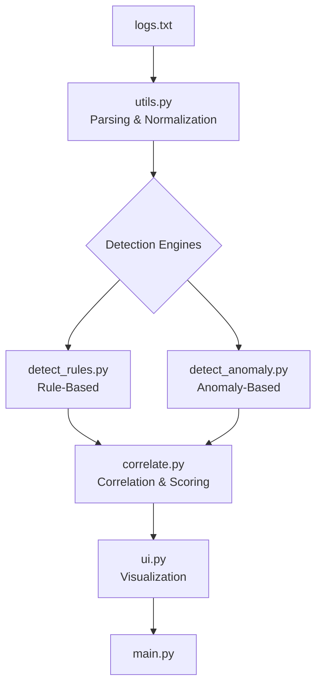

# soc-detection-correlation-lab

**SOC Detection & Correlation Fundamentals**

---

## Project Objective

The objective of this project is to demonstrate **core SOC detection and correlation principles**, focusing on how multiple detection techniques are used together rather than relying on a single alerting method.

This project is intentionally **educational**, not production-grade.  
It is designed to deepen understanding of how SOCs actually work internally — mechanics that are often hidden behind enterprise tools.

The emphasis is on:

- How individual detections generate **partial, low-confidence signals**
- Why single detections are insufficient on their own
- How correlation adds context and turns alerts into investigations

This project avoids novelty or automation claims and instead focuses on **foundational SOC concepts** that apply across tools and platforms.

---

## Detection Approaches Implemented

This project implements **two complementary detection approaches**, each covering different blind spots.

### 1. Rule-Based Detection  
Implemented in `detect_rules.py`

Rule-based detections identify **explicit, known attack behaviors**, including:

- Web login brute force attempts  
- SSH brute force activity  
- Firewall port scanning  
- Windows authentication failures  

**Strength:** Precise and reliable  
**Limitation:** Narrow and context-limited

---

### 2. Anomaly-Based Detection  
Implemented in `detect_anomaly.py`

Anomaly-based detections identify **behavioral deviations**, including:

- Time-weighted activity bursts  
- Cross-surface activity across multiple systems  

**Strength:** Broad visibility  
**Limitation:** Noisy when used alone

---

### Why Correlation Matters

This project demonstrates that:

- Rule-based detections provide **strong but narrow** signals  
- Anomaly-based detections provide **weak but broad** signals  
- Correlation combines them to create **investigation-ready context**

Correlation does not replace detections — it **connects them**.

---

## Detection & Correlation Pipeline



---

## File Overview

### `logs.txt`
**Sample dataset used to drive detections**

- Contains mixed log formats:
  - Web
  - Firewall
  - Windows
  - SSH
  - EDR-style events
- Enables multi-source detection and correlation
- Serves as a reproducible test input for anyone cloning the repository

---

### `main.py`
**Pipeline entry point**

- Loads and parses logs
- Runs detection modules
- Correlates detection outputs
- Passes results to the UI layer

> No detection logic exists here by design.

---

### `utils.py`
**Log parsing and normalization**

- Parses multiple log formats into a unified event schema
- Normalizes timestamps and entity identifiers
- Ensures consistent structure for all detection engines

---

### `detect_rules.py`
**Rule-based detection engine**

- Applies explicit detection logic
- Emits structured detection signals
- Preserves timestamps and evidence
- Outputs signals, not final alerts

---

### `detect_anomaly.py`
**Anomaly-based detection engine**

- Tracks entity behavior in sliding time windows
- Detects relative deviations:
  - Activity bursts
  - Cross-surface behavior
- Generates contextual anomaly signals

---

### `correlate.py`
**Signal correlation and scoring layer**

- Combines rule and anomaly signals
- Aggregates by entity
- Computes cumulative risk scores
- Assigns severity based on combined evidence

---

### `ui.py`
**Presentation and visualization layer**

- Event-based alert view (what fired and why)
- Case-based view (entity risk over time)
- Anomaly explanation graphs
- Correlation contribution visualizations

---

## How to Run

### 1. Clone the repository
```bash
git clone https://github.com/mhdzayid/soc-detection-correlation-lab

command: cd soc-detection-correlation-lab

dependency:
  - matplotlib
install:
  command: pip install matplotlib

run:
  command: python main.py

