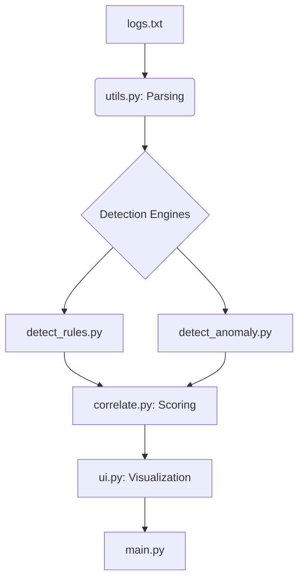

# soc-detection-correlation-lab
SOC Detection & Correlation Fundamentals
Project Objective

The objective of this project is to demonstrate how multiple SOC detection techniques are used together and correlated, rather than relying on a single alerting method.

This project is intentionally educational and for deeper understanding of SOC, focusing on core SOC mechanics that are often hidden behind enterprise tools. It is not designed to be novel, automated, or production-scale.

The emphasis is on:
How detections generate partial signals
Why individual detections are insufficient on their own
How correlation adds context for investigations

Detection Techniques Implemented
This project implements two detection approaches, each covering different blind spots:

1. Rule-Based Detection
Implemented in detect_rules.py
These detections identify known, explicit attack behaviors, such as:
Web login brute force attempts
SSH brute force activity
Firewall port scanning
Windows authentication failures

2. Anomaly-Based Detection
-Implemented in detect_anomaly.py
-These detections identify suspicious behavior patterns, including:
-Time-weighted activity bursts
-Cross-surface activity across multiple systems

This project demonstrates how:
-Rule-based detections provide strong but narrow signals
-Anomaly-based detections provide weak but broad signals
-Correlation combines them to create investigation-ready context

File Overview

###logs.txt
[Sample dataset used to drive detections]
 Provides mixed log formats (web, firewall, Windows, SSH, EDR) in one file
-Lets the pipeline demonstrate multi-source detection + correlation
-Acts as a reproducible test input for anyone cloning the repo

###main.py
[Entry point for the project]
-Loads logs
-Runs detection modules
-Correlates detection outputs
-Passes results to the UI layer

###utils.py
[Log parsing and normalization]
-Parse multiple log formats (web, firewall, SSH, Windows, EDR)
-Normalize timestamps and entities
-Ensure consistent event structure for detections

###detect_rules.py
[Rule-based detection engine]
-Apply explicit detection logic
-Emit structured detection signals
-Preserve evidence and timestamps
-Outputs rule signals, not final alerts.

###detect_anomaly.py
[Anomaly-based detection engine]
-Track entity behavior in sliding time windows
-Detect relative deviations (bursts, cross-surface activity)
-Generate contextual anomaly signals

###correlate.py
[Signal correlation and scoring layer]
-Combine rule and anomaly signals
-Aggregate by entity
-Compute cumulative risk scores
-Assign severity based on combined evidence

###ui.py
[Presentation and visualization layer]
-Event-based alert view (what fired and why)
-Case-based view (entity risk over time)
-Anomaly explanation graphs
-Correlation contribution visualizations
